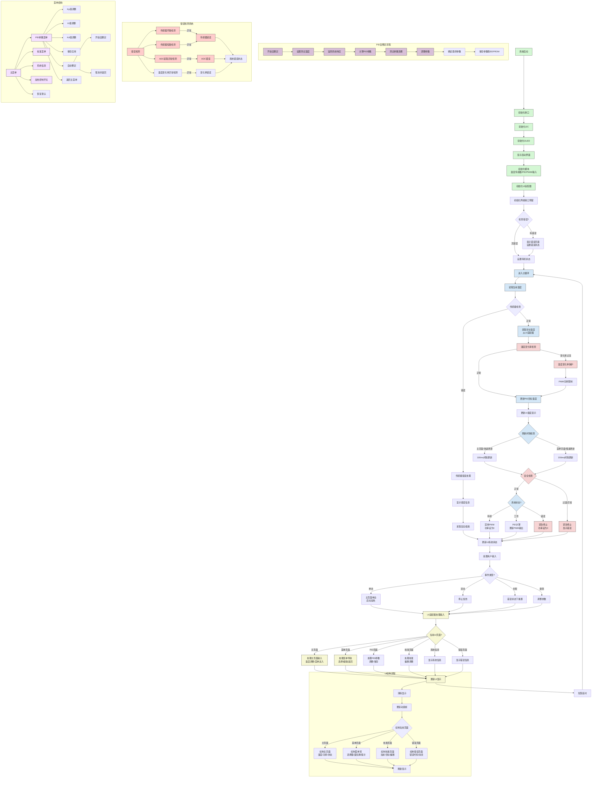

# ESP32-S3 温控系统流程图（增强版）

## 最新流程说明

### 主要功能增强

1. **增强错误检测系统**
   - 添加传感器开路检测：监测NTC100K传感器连接状态
   - 添加传感器短路检测：监测NTC100K是否短路
   - 添加ADC读取异常检测：监测ADS1115读数是否正常
   - 完善错误处理流程：根据错误类型采取不同安全措施

2. **温度变化率监控**
   - 实时监测温度变化速率：检查温度上升或下降是否过快
   - 自适应功率限制：当变化率过高时限制PWM功率输出
   - 防止加热失控：减少温度过冲并保护加热元件

3. **UI响应性优化**
   - 自适应刷新率策略：根据不同页面需求调整刷新间隔
   - 主页面/关键数据：使用较快刷新率保证实时性
   - 菜单页面/静态内容：使用较慢刷新率减少资源占用
   - 考虑SSD1306刷新特性优化显示更新

4. **菜单导航优化**
   - 添加导航面包屑：显示当前位置和层级关系
   - 增强视觉提示：突出显示可选项和当前位置
   - 直观的操作提示：在界面底部显示操作指南

5. **完整的PID自整定流程**
   - 集成完善的PID算法库：利用成熟算法进行参数整定
   - 测试-监测-调整流程：自动进行系统响应测试
   - 一键自整定：用户友好的自整定启动和监控界面
   - 参数存储：自动将优化后的参数保存到EEPROM

6. **网络功能接口预留**
   - 初始化阶段预留网络接口
   - 为后续功能扩展提供便利
   - 不影响当前核心温控功能

### UI界面增强

1. **主页面增强**
   - 添加温度变化率指示器
   - 优化动画进度条视觉效果
   - 增加系统状态图标指示器

2. **菜单页面增强**
   - 添加导航面包屑显示当前路径
   - 优化选择器视觉效果
   - 增加参数调整提示和范围显示

3. **自整定页面**
   - 显示自整定进度和阶段
   - 实时显示测试温度和系统响应
   - 完成后显示新旧参数对比 